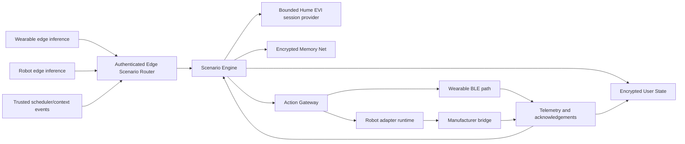

# AI-Native Integration Guide

Status: development prototype — simulated devices and inference only

Last reviewed: 20 July 2026

## 1. Scope and assurance boundary

This guide describes the Veryloving-owned AI-native coordination layer for Product 1 (the VL01 BLE wearable) and Product 2 (the home companion robot). The layer combines account-scoped state, summary memory, deterministic scenario execution, simulated edge inference, and the existing signed device-action gateway.

The implementation can exercise both product paths without real hardware. That is useful for software integration and failure testing, but it is not evidence of clinical accuracy, emergency-delivery reliability, fall-detection sensitivity, autonomous-navigation safety, camera coverage, battery life, or sub-100 ms inference on a target processor.

The following remain **BLOCKED — EXTERNAL**:

- approved Yongyida or Jiangzhi API/SDK contracts, production endpoints, credentials, and SLAs;
- target wearable firmware, sensor calibration, and physical Cortex-M profiling;
- target robot camera, microphone, motor-control, NPU/GPU, serial/GPIO, and safety-controller contracts;
- Hume EVI production credentials, voice/persona configuration, and provider availability testing;
- APNs/FCM, Twilio, caregiver consent, emergency-routing policy, and physical-device validation.

Ownership and unblocking actions are tracked in [external-dependencies-dashboard.md](./external-dependencies-dashboard.md); manufacturer contract requirements are in [manufacturer-api-requirements.md](./manufacturer-api-requirements.md).

No simulated health or emotion value should be used for diagnosis, treatment, medication decisions, dispatch, or a representation that a real person is safe. A scenario reaching `completed` means the configured software steps completed; it does not prove that a person received help or that a device performed a physical action.

| Capability | Status | Evidence/remaining gate |
| --- | --- | --- |
| Account-bound encrypted User State and trends | PASS — software | Domain API plus tested DynamoDB ciphertext repository; production table/key operations still require deployment |
| Encrypted summary Memory Net with recall/export/delete | PASS — software | Local recall/privacy tests plus tested DynamoDB ciphertext repository; production key management still requires deployment |
| Priority/idempotent/cancellable Scenario Engine | PASS — software | Five versioned workflows, tested DynamoDB execution repository, and fail-closed restart reconciliation; production remains explicitly single-replica pending a distributed lease protocol |
| Dual-device mock telemetry and dashboard | PASS — simulated | Loopback development/test service only |
| Authenticated AI-native server composition and ingress | PASS — software | `createAINativeSystem` is fail-closed and `clm-server` mounts authenticated scenario, edge, cancellation, privacy, and voice-memory integration when the durable system is injected; deployment construction and credentials remain external |
| Hume EVI live empathetic sessions | BLOCKED — EXTERNAL | Enterprise key, approved configuration/personas, and availability validation |
| Wearable edge inference and battery target | BLOCKED — EXTERNAL | Final firmware/model/sensors and target-hardware profiling |
| Robot perception, voice, navigation, and camera stream | BLOCKED — EXTERNAL | Approved vendor HAL/SDK, exact robot, safety/privacy validation |
| Push, SMS, calls, and caregiver delivery | BLOCKED — EXTERNAL | APNs/FCM/Twilio credentials, consent/escalation policy, provider receipts |

## 2. Architecture



The important trust boundaries are:

1. Edge modules emit normalized observations; they do not directly invoke emergency or robot actions.
2. The Scenario Engine validates a trigger, checks account and device scope, applies idempotency and priority, and invokes an allowlisted workflow.
3. The Action Gateway remains the authority that resolves device bindings, signs action envelopes, and dispatches through the correct device-specific queue.
4. User State stores timestamped observations for trend queries. Memory Net stores deliberately selected summaries, not raw conversations, camera frames, microphone audio, or opaque provider transcripts.
5. Manufacturer credentials and hardware serials remain server-side. Structured logs use bounded metadata and one-way references, never raw action parameters, secrets, user text, sensor payloads, coordinates, or serial numbers.

Hume EVI is the conversational and emotional-interaction provider, not the authorization or life-safety policy engine. A scenario may request an allowlisted Hume mode such as a voice check or calming session. A separately authenticated Hume tool ingress may propose an allowlisted scenario trigger, but deterministic server code must validate it before execution. That code decides whether a scenario may start, which bound devices may act, when a timeout has elapsed, and which fallback is required. This keeps a model response, prompt injection, or provider outage from changing device identity or bypassing escalation policy.

For direct coordinated dispatch, `ActionGateway.routeMany` accepts 1–10 fully validated, idempotent child actions and supports parallel or sequential execution. Parallel dispatch preserves the independent wearable and robot queues, so a stalled BLE path does not prevent a robot request from starting. Scenario workflows use `ActionGatewayScenarioRuntime`, which creates stable child idempotency keys and delegates each side effect back through the same gateway rather than bypassing its binding and signature checks.

Source boundaries:

- [UserState.ts](../server/src/models/UserState.ts) — account-bound encrypted state and history
- [ScenarioEngine.ts](../server/src/orchestration/ScenarioEngine.ts) — workflow execution, timeout, fallback, cancellation, and idempotency
- [EdgeScenarioRouter.ts](../server/src/orchestration/EdgeScenarioRouter.ts) — authenticated inference/context mapping, freshness, source binding, and thresholds
- [TelemetryStateIngestor.ts](../server/src/orchestration/TelemetryStateIngestor.ts) — bounded edge-envelope projection into encrypted account state
- [AINativeRuntime.ts](../server/src/orchestration/AINativeRuntime.ts) — bounded Hume context, concrete User State/Memory Net composition, and coordinated account fencing
- [AINativeSystem.ts](../server/src/orchestration/AINativeSystem.ts) — fail-closed composition root for stores, workflows, edge routing, and privacy export/deletion
- [MemoryNet.ts](../server/src/memory/MemoryNet.ts) — encrypted summary memory, recall, export, and deletion
- [WearableEdgeAI.ts](../server/src/edge/WearableEdgeAI.ts) — deterministic wearable sensor/inference simulator
- [RobotEdgeAI.ts](../server/src/edge/RobotEdgeAI.ts) — deterministic robot perception/voice simulator
- [`server/src/scenarios/`](../server/src/scenarios/) — the five cross-device workflow definitions
- [ManufacturerMockServer.ts](../server/mocks/ManufacturerMockServer.ts) — development-only dual-device transport and dashboard

## 3. Request and data lifecycle

### 3.1 Observations

Every accepted observation should carry an authenticated account context, a Veryloving logical device ID, an observed timestamp, and a source label. Do not let Hume, a mobile client, or a manufacturer callback select another account ID. Validate freshness, numeric bounds, and device binding before writing state or evaluating a trigger.

The Scenario Engine is a domain API, not a public telemetry-ingestion endpoint. `EdgeScenarioRouter` is the post-authentication domain router: it verifies freshness and the expected telemetry source reference, maps allowlisted inference/context events to one scenario ID, and derives stable idempotency keys before calling `startScenario`. A transport controller still must authenticate the producer and load the account's binding before invoking it. The development simulator's event injector only creates a synthetic event; tests provide the trusted in-process wiring.

The simulated edge modules normalize:

- wearable accelerometer, PPG-derived heart rate/HRV, temperature, UTC day-to-date steps, battery, activity, stress, and fall classification; coarse `home`/`away` context is supplied separately by the authenticated transport;
- robot derived vision/prosody/motor features, fall/facial-expression classification, local voice intent/emotion, and motor safety. Bedroom-inactivity policy comes from the trusted scheduler, while camera readiness comes only from a correlated manufacturer acknowledgement.

The simulator produces synthetic values. In production, replace each generator/inference boundary with an approved parser and model while preserving the normalized output contract.

### 3.2 State and memory

User State and Memory Net require a server-owned 256-bit encryption key (or versioned keyring) and an account identifier on every operation. The account is converted to a keyed opaque storage key; AES-GCM authenticates the domain, opaque storage key, revision, and—starting with key version 2—the key version. A copied ciphertext record must not decrypt under another account/domain/revision. Key rotation retains the stable account-index key, rewrites each account aggregate with `migrateEncryption`, and retires an old data key only after migration is verified.

Use User State for current and time-series facts such as device status, steps, medication confirmation, mood, and heart-rate observations. Use Memory Net only for concise personalization facts that have a defined purpose and retention policy. Examples include “prefers classical music in the morning” or a bounded summary of a shared life event. Do not use raw transcripts as memory.

`createAINativeScenarioRuntime` composes these stores with Action Gateway and the injected Hume/provider functions. Before a Hume session it builds a bounded context: selected current health/context values, up to five summarized recalls, relationship count/trust metadata, and device type/connectivity/battery only. It omits device IDs and precise coordinates, and never supplies raw transcript/audio/video. Sending even summarized health or life-event context to Hume still requires the applicable user consent, provider data terms, retention controls, and production credential gate.

`AINativeAccountLifecycle` supplies the process-local half of the deletion fence: it rejects new provider work, aborts and drains in-flight work (including composed export), invokes the Action Gateway and Scenario Engine account fences, then deletes User State, Memory Net, scenario analytics, and provider-owned Hume/signal records. The runtime now requires a lifecycle instance; production must pass that same instance to both `createAINativeScenarioRuntime` and the privacy coordinator. The external export provider receives an abort signal; the erasure callback is mandatory and must be idempotent. Every provider must honor its abort signal or deletion can remain safely blocked while work drains.

The compiled source includes two production persistence primitives. `DynamoCiphertextRepository` stores only HMAC-derived storage keys and AES-GCM records, uses strongly consistent reads and conditional revision writes, and fails closed before DynamoDB's item-size ceiling. `DynamoScenarioExecutionRepository` uses transactional idempotent admission, monotonic updates fenced by an account deletion tombstone, bounded account export/deletion, and retry handling for unprocessed deletes. It requires a table with string `PK`/`SK` keys and an `ALL`-projected GSI whose partition/sort keys are `GSI1PK`/`GSI1SK` (the index name is configurable). These classes provide durable repository implementations; they do not create tables, retrieve KMS keys, supply a distributed execution lease, or prove backup/restore behavior.

Exports return only the authenticated account's decrypted records. Account deletion must first move the account to a server-owned `deleting` state that fences new state, memory, scenario, outbox, and adapter mutations; it then deletes all related records through the established privacy workflow. Without that lifecycle fence, a concurrent write can recreate data after a delete scan. Treat an upstream manufacturer's “accepted” deletion response as incomplete until the relevant deletion contract provides confirmation.

### 3.3 Scenario execution

A scenario execution has a stable execution ID and idempotency key. Its state progresses through the engine's terminal-safe lifecycle; step results and timestamps are retained as bounded analytics metadata. A retry with the same account, scenario, trigger, and idempotency key joins or returns the original execution. Reusing a key for a different request is rejected.

The engine intentionally does not blindly resume a non-terminal execution after process death because workflow input is deliberately ephemeral. `reconcileAccountAfterRestart` finds orphaned `queued`/`running` snapshots, requires the configured recovery provider before closing a Critical orphan, and then marks the record failed with `PROCESS_RESTARTED`. Production must still provide durable storage, a way to enumerate affected accounts, an idempotent `onRecoveryRequired` escalation, startup/lazy reconciliation ownership, and crash tests. Do not describe this as step-level resume.

Priority is explicit:

| Priority | Intended use | Scheduling rule |
| --- | --- | --- |
| Critical | Fall response and AI Angel emergency flow | Dedicated reserved lane plus separate global/account admission caps; never drop silently |
| Standard | Medication and emotional check-in | Per-device ordering with bounded timeout and documented escalation |
| Background | Cognitive engagement analytics and trend summaries | Yield to higher priorities and remain cancellable |

Cancellation propagates an abort signal through undispatched queue work, retry/transport waits, and cancellable scenario providers, then marks the execution accordingly. If robot navigation may be active, the engine issues a separately bounded, idempotent `emergency_stop` compensation and records its outcome. It also records already-delivered alarms, messages, calls, camera sessions, and audio actions under `cancellation.nonRetractable`; those effects must be shown as unknown/possibly sent rather than claimed as retracted. Robot outbox records distinguish pre-dispatch `ACTION_CANCELLED` from `ACTION_CANCELLED_NON_RETRACTABLE`, and a wearable abort after send carries `nonRetractable: true`. A production audit store should also retain any late authenticated acknowledgement.

The router treats a local robot `cancel` intent only as `cancellationRequested`; it does not select or stop a Critical execution. An authenticated user or authorized caregiver must identify the execution and call `confirmCancellation`. Physical release must additionally establish speaker/user confirmation, liveness, false-activation handling, an audit trail, and which life-safety steps can no longer be cancelled.

## 4. Configuring the Scenario Engine

Construct the engine with explicit dependencies rather than global credentials. The injected action dispatcher, state store, memory store, clock, analytics sink, and notification/caregiver fallbacks make execution deterministic in tests and replaceable in production. `createAINativeSystem` is the domain composition root: it requires ciphertext and scenario repositories (including exhaustive account export), a rotation-capable keyring, an identity secret, every side-effect provider, and an external privacy provider; creates User State, Memory Net, the shared account lifecycle, runtime, five definitions, Scenario Engine, telemetry ingestor, and Edge Scenario Router; and exposes coordinated voice context and export/deletion boundaries. `clm-server` accepts this composed system as an injected dependency and fails closed when AI-native mode is enabled without it.

The focused tests exercise the domain components in process and route-level tests cover the server controllers. Both long-lived command-line entrypoints pass through `ai-native-composition.cjs`. In production, `AI_NATIVE_PRODUCTION_MODULE` must be an absolute path inside the reviewed deployment image. That CommonJS module exports synchronous `createAINativeProductionDependencies({ env, logger })` and returns contract version `1`, five required capability declarations, durable system options, the four trust hooks below, and an optional cleanup function. The entrypoint constructs the official `createAINativeSystem` before listening. It rejects the bundled in-memory repository classes, a legacy raw encryption key, missing providers/hooks, an incomplete capability contract, and asynchronous startup. These structural declarations are a fail-closed interface, not independent proof that an external store, KMS, or provider is durable; release validation must verify the packaged implementation and infrastructure. The provider module must obtain keyring material and credentials from the deployment secret/KMS boundary; nothing is read from a public mobile variable.

Set `AI_NATIVE_DATA_LIFECYCLE_ENABLED=true` before an environment first stores AI-native state or memory, and never turn that lifecycle flag off while such data may exist: export and erasure continue to include the durable AI-native repository even while orchestration is disabled. Set `AI_NATIVE_ENABLED=true` only after the production composition module is packaged; runtime enablement requires the lifecycle flag. Production also requires `AI_NATIVE_SINGLE_REPLICA=true` until distributed scenario-admission leases exist. This is an explicit temporary topology gate; the server refuses to start if a gate is absent. The deployment module must inject four trust-boundary functions:

- `resolveEdgeDeviceBinding` — resolves an app-authenticated wearable source to the account's server-owned command targets and source references;
- `authenticateRobotEdgeIngress` — authenticates the manufacturer callback credential and returns its account and active robot binding;
- `resolveScenarioDevices` — derives wearable/robot targets for an authenticated app, voice, or scheduler scenario without accepting client-selected IDs;
- `authenticateScenarioIngress` — authenticates the trusted medication/occupancy scheduler before accepting context events.

These are code-level trust hooks, not public environment credentials. Their backing secrets, repositories, and key material belong in the server secret manager. The exact authenticated HTTP and voice transport shapes are documented in [api-reference-ai-native.md](./api-reference-ai-native.md).

Configuration rules:

- enable each scenario explicitly for the deployment and, where applicable, for the user's consent profile;
- use server-owned, bounded timeout values; tests may shorten virtual time, but production safety timers must match the approved care protocol;
- derive idempotency keys from a trusted event ID and scenario version, never from free-form model text alone;
- resolve wearable and robot bindings from the authenticated account; reject missing, offline, stale, or cross-account targets;
- keep notification and SMS delivery as explicit, observable fallback steps rather than assuming transport acceptance equals delivery;
- route Hume output through a strict trigger/tool schema. Hume must not generate manufacturer IDs, arbitrary URLs, phone numbers, or unrestricted action parameters.

The development simulator supports deterministic latency and failure injection. `MOCK_MANUFACTURER_URL` is permitted only for a loopback origin when `NODE_ENV` is `development` or `test`; production configuration rejects it. See [robot-adapter-integration-guide.md](./robot-adapter-integration-guide.md) for the adapter bridge configuration.

Synthetic dual-device events are configured with `MOCK_MANUFACTURER_FALL_EVENT_RATE`, `MOCK_MANUFACTURER_STRESS_EVENT_RATE`, `MOCK_MANUFACTURER_MEDICATION_REMINDER_EVERY_TICKS`, `MOCK_MANUFACTURER_TELEMETRY_INTERVAL_MS`, and `MOCK_MANUFACTURER_SEED`. Set event rates to zero for a quiet deterministic walkthrough and inject the desired event explicitly. The HTML dashboard is at `GET /dashboard`; it shows live devices and real/synthetic executions and can launch all five workflows. Setup, its local cookie/proxy boundary, and operator acceptance steps are documented in [demo-dashboard.md](./demo-dashboard.md); authenticated JSON/event/SSE routes are listed in [api-reference-ai-native.md](./api-reference-ai-native.md).

## 5. The five workflows

All durations below are workflow policy inputs. Automated tests use controlled clocks and do not wait 15 real minutes.

### 5.1 Fall response

Trigger: a fresh, high-confidence wearable fall observation with impact and post-impact inactivity.

1. Mark the execution critical and attach a server-owned opaque location reference (the authenticated provider resolves it to the account's permitted current/last-known location; the workflow does not persist coordinates).
2. If fresh authenticated robot inference reports `safeToMove`, request navigation to that opaque target; otherwise skip motion and alert immediately.
3. Start a local Hume-backed voice check through the robot; this is not yet an emergency-contact call or video stream.
4. Await a bounded user-response signal.
5. If the robot is offline, navigation fails, or no response arrives within the configured window, invoke the emergency-contact fallback immediately with the permitted location/context. Include camera context only after an authenticated acknowledgement proves `camera_ready` for the exact server-derived session reference.

The software simulator cannot validate physical fall detection, obstacle avoidance, arrival, camera visibility, audio intelligibility, or emergency-contact delivery.

### 5.2 Medication adherence

Trigger: a trusted, account-owned schedule occurrence, not model-generated free text.

1. Ask the robot to display and speak the reminder.
2. Await a wearable movement/proximity confirmation associated with that reminder.
3. If no confirmation arrives within the configured adherence window, request caregiver push notification.
4. If the escalation policy still has no confirmation, request the SMS fallback.
5. Record `reminded`, `confirmed`, `declined`, or `unconfirmed`; never infer ingestion solely from movement.

Medication identifiers should be opaque. Do not put medication names, dosage, or medical history in logs or notification previews without an approved privacy policy.

### 5.3 Emotional check-in

Trigger: a fresh wearable stress classification whose threshold and cooldown rules are enabled.

1. Ask the robot to initiate a gentle check-in.
2. Offer a configured breathing exercise, meditation, or calming activity.
3. Store only a bounded emotional summary or user-provided mood when consent permits.
4. Schedule a bounded later check-in only when the observer explicitly returns `responded: false` (including an intentional `not_found` outcome); record transport/provider failures separately rather than inferring silence.

HRV-derived stress and facial/voice emotion are probabilistic wellness signals, not diagnoses. Hume-backed empathetic conversation remains external until credentials and production policies are configured.

### 5.4 Cognitive engagement

Trigger: a trusted scheduler event indicating the configured morning inactivity condition. The current robot edge envelope does not contain occupancy; a future camera/occupancy provider must remain an authenticated, consented scheduler input.

1. Query the wearable's current step/activity state.
2. If it is below the configured threshold, offer a walk or an allowlisted cognitive activity.
3. Record a bounded engagement outcome only from an explicit response or explicit `responded: false`; an unavailable observer becomes availability analytics, not a user outcome.
4. Do not label cognitive decline from one event; any longitudinal flag requires an approved clinical/product rule and human review.

The simulator can emit a synthetic inactivity event, but its robot edge classifier does not derive room occupancy. Any future camera-derived occupancy must not be enabled on real hardware without consent, retention, placement, and false-positive review.

### 5.5 AI Angel auto-dial

Trigger: a verified panic-button event, fall event, or tightly allowlisted authenticated voice intent.

1. Request the wearable emergency-call path.
2. Request a robot room-view session using the server-secret, account/execution-scoped reference; expose a link only after a correlated `camera_ready` acknowledgement.
3. Request the allowlisted robot two-way-call action and Hume emergency-session provider independently; neither transport acceptance nor the mock is proof that audio reached a contact.
4. If robot/Wi-Fi delivery fails, request the SMS fallback containing only the permitted GPS snapshot.

The repository's mock implementation does not place a real call, send an SMS, expose a real video feed, or prove delivery. Twilio, APNs/FCM, Hume, camera-stream authorization, and emergency-policy approval remain external gates.

## 6. Extending the system

### 6.1 Add a scenario

1. Define a versioned scenario and allowlisted trigger in [`server/src/scenarios/`](../server/src/scenarios/).
2. Assign one priority and declare every device target, timeout, retry boundary, cancellability rule, and fallback.
3. Validate parameters at the boundary; never pass free-form model objects directly to an adapter.
4. Use one idempotency key for the logical execution and stable child keys for side-effecting steps.
5. Record bounded state transitions without PII or raw sensor payloads.
6. Add happy-path, offline, timeout, cancellation, duplicate-trigger, cross-account, and latency-budget tests.
7. Document which outcomes mean transport acceptance versus verified physical completion.

### 6.2 Add a memory kind

1. Establish a specific personalization purpose, user-visible label, source, confidence, and retention period.
2. Store a concise summary, never an unrestricted transcript or media blob.
3. Add schema validation and a bounded recall filter.
4. Include the kind in account export and specific/all-memory deletion tests.
5. Confirm account-bound authenticated encryption and log redaction.

Recall output is context for a response generator, not an instruction authority. Before including recalled text in a Hume prompt, delimit it as user memory and prevent it from altering tool policies or device bindings.

## 7. Edge hardware integration contracts

### 7.1 Wearable target

The simulated wearable boundary expects timestamped accelerometer samples, PPG/heart-rate observations, skin/ambient temperature as defined by hardware, and optional location supplied by the paired mobile app. Production integration must document sampling frequency, units, integer/float representation, endian order, calibration, missing-sample flags, monotonic sequence, clock synchronization, BLE fragmentation, and integrity checks.

The provisional production model candidate is an int8 1D depthwise-separable CNN with three temporal blocks, a `[1, 128, 5]` sensor tensor, and fall, stress, and activity heads under 120,000 parameters. It is an engineering architecture target only; no trained weights, dataset rights, model card, clinical validation, or final-hardware profile are available yet.

Target acceptance gates include:

- an approved TensorFlow Lite Micro or equivalent model artifact with version/hash and representative validation data;
- target-specific ARM Cortex-M RAM, flash, CPU/DSP instruction, tensor-arena, and sensor-buffer measurements;
- measured p95/p99 inference under 100 ms on final hardware, including acquisition and preprocessing policy;
- measured daily battery impact below 10% under an agreed workload and radio schedule;
- fall and stress sensitivity/specificity targets, false-alarm behavior, watchdog recovery, and signed OTA rollback.

Until these are measured, `latencyMs` from the TypeScript simulator is software timing only.

### 7.2 Robot target

The simulated robot boundary uses bounded scene/voice feature objects instead of retaining raw media. A production edge service must define camera resolution, frame rate, color space, orientation, timestamping, privacy masks, microphone sample rate/format/channel count, acoustic-echo cancellation, and secure IPC framing.

Provisional candidates are a quantized pose-plus-temporal CNN for fall detection, quantized MobileNetV3-Small expression classification without embedding retention, and small-footprint keyword/intent plus prosody models for offline voice. Vendor runtime support, training data and bias review, accuracy, thermal behavior, and safety validation are unresolved.

The serial/GPIO statement in the product concept is not yet a verified vendor interface. Prefer an authenticated local Android service, Unix-domain socket, gRPC, or vendor HAL when available; reserve GPIO for simple safety-rated signals rather than rich payload transport. Required hardware evidence includes NPU/GPU model support, RAM/thermal budget, secure boot, model signing, watchdog behavior, motor-controller isolation, and offline speech-language coverage.

Raw camera frames and microphone audio should remain on-device unless a user-authorized, encrypted session explicitly requires transmission. Face analysis must not be used as identity proof, diagnosis, or an unrestricted surveillance capability.

## 8. Privacy and security checklist

- Authenticate first and derive `accountId` from the server session.
- Authorize every device and memory/state key against that account.
- Encrypt records at rest with an independently managed 256-bit key; rotate through a versioned key policy.
- Bind authenticated-encryption metadata to account, record type, record ID, and schema version.
- Keep current state, historical samples, memory summaries, scenario executions, and adapter outbox within explicit retention limits.
- Support account export, specific-memory deletion, all-memory deletion, and complete account deletion.
- Never log PII, raw prompts/transcripts, coordinates, action parameters, health measurements, keys, tokens, serials, camera/audio content, or plaintext records.
- Reject stale, replayed, malformed, oversized, cross-account, cross-binding, or unknown-version inputs.
- Treat edge and manufacturer telemetry as untrusted until authenticated, schema-validated, bounded, and freshness-checked.
- Keep mock endpoints loopback-only and fail startup in production.

## 9. Verification and production readiness

Run the focused TypeScript and integration suites documented by the repository's package scripts, then run the full gate:

```bash
npm run typecheck:ai-native
npm run test:ai-native
npm test
npm run validate
```

The tests demonstrate deterministic software behavior against simulated inputs and loopback transports. Production approval additionally requires vendor-contract conformance, threat modeling, privacy/legal review, physical wearable and robot validation, end-to-end notification/call delivery tests, Hume failure testing, accessibility testing, incident response, monitoring, load/soak testing, and a reviewed human escalation policy.

The focused integration suite is [scenarios.test.ts](../server/tests/integration/scenarios.test.ts). Its five happy paths measure authenticated in-process edge routing through terminal Scenario Engine state and `ActionGateway.waitForDeliveries()` with zero-delay test providers, asserting under 500 ms. Separate cases cover offline fallback, virtual-clock timeout, policy-approved cancellation, replay/idempotency, and encrypted export/deletion. This is a deterministic software budget, not a hardware, Hume, carrier, or manufacturer SLA.

For method-level contracts, see [api-reference-ai-native.md](./api-reference-ai-native.md). For operational failures, see [troubleshooting-ai-native.md](./troubleshooting-ai-native.md). For a simulated partner presentation, see [demo-script.md](./demo-script.md).
