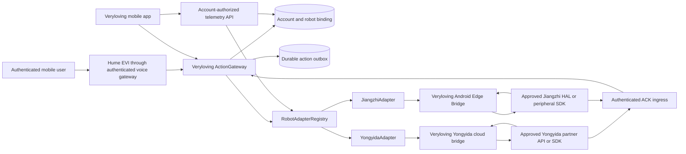
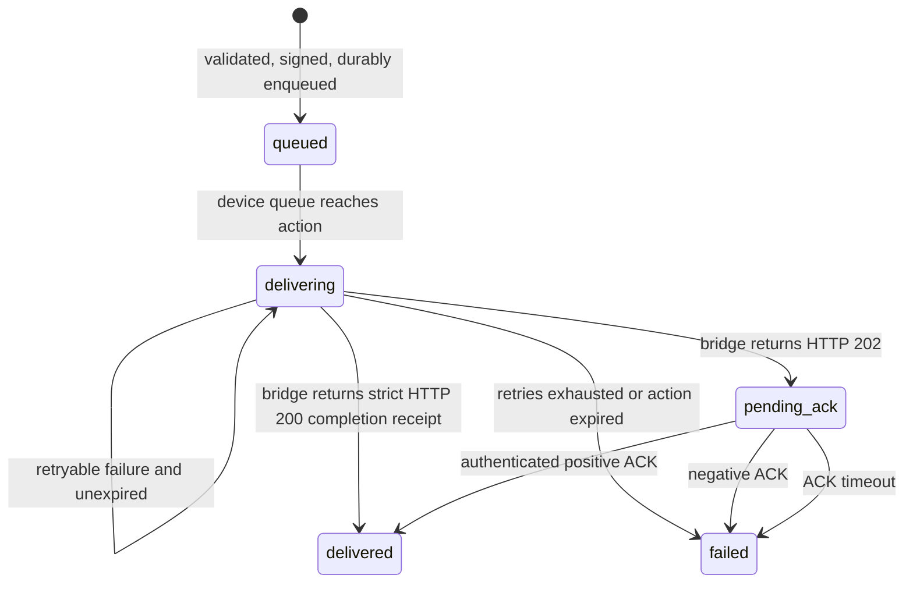

# Product 2 Robot Hardware Abstraction Architecture

Status: prototype contract and production-oriented design
Last reviewed: 18 July 2026

## 1. Scope and evidence boundary

This document describes the Veryloving-owned hardware abstraction layer (HAL) for Product 2. It lets one orchestration service address Yongyida and Jiangzhi robots without putting vendor-specific payloads, credentials, or device identities into Hume tool calls or the mobile client.

The boundary is deliberate:

- `RobotAdapter`, `vl-robot-action/2`, `vl-robot-reset/1`, `veryloving.robot-bridge.v1`, `VL_*`, `vl.edge.*`, and every `/v1/veryloving/...` path in this repository are **Veryloving provisional contracts**.
- They are not published Yongyida or Jiangzhi APIs, SDK methods, command names, or compatibility promises.
- Public evidence supports a Yongyida open-SDK claim and a plausible Jiangzhi Android edge-app path, but no public API reference, authentication contract, telemetry schema, SDK artifact, or production SLA was found for either vendor.
- The prototype therefore terminates at a Veryloving-owned bridge. An approved vendor API/SDK/HAL must be implemented behind that bridge after partner documentation, credentials, licensing, and exact hardware are supplied.

The evidence and vendor comparison are maintained in [hardware-partner-research.md](./hardware-partner-research.md). This architecture does not turn a marketing statement into a verified technical fact.

## 2. Design goals

The HAL is designed to provide:

1. One vendor-neutral command and telemetry model for the orchestration layer.
2. Simultaneous mixed-vendor operation, including multiple robots from either vendor.
3. Immutable account, robot, manufacturer-device, and adapter binding.
4. Signed, expiring, idempotent actions with durable asynchronous acknowledgement.
5. Per-device ordering without cross-device or cross-vendor head-of-line blocking.
6. Bounded time, retry, payload, pagination, queue, and memory behavior.
7. Fail-closed parsing and authentication, plus privacy-safe observability.
8. A replaceable bridge boundary for partner-only SDKs and protocols.

Non-goals for this prototype are:

- Claiming that either vendor already supports the provisional operations.
- Controlling a production Jiangzhi robot through ADB or UI automation.
- Treating HTTP acceptance as proof that a physical action occurred.
- Treating robot-attached health instruments as clinically validated integrations.
- Providing autonomous navigation or medical diagnosis without separate safety and regulatory approval.

## 3. System context



This diagram shows the implemented provisional command/ACK and telemetry-polling boundaries. The mixed-vendor runtime implements signed command delivery, asynchronous ACK handling, and an account-authorized bounded snapshot covering status, battery, vitals, location, navigation, indoor position, safety events, and medication acknowledgements. A real vendor translation, authenticated vendor event/callback ingestion, medical provenance, retention/consent policy, and exact-hardware behavior remain target work until an approved partner contract is supplied and exercised.

The long-lived voice/action gateway is the trust boundary for device actions. The HTTP-only Vercel adapter must not be used for robot action delivery because it does not own the WebSocket session or the durable action lifecycle.

## 4. HAL contract

The source of truth is [`server/src/adapters/RobotAdapter.ts`](../server/src/adapters/RobotAdapter.ts). The interface is server-side TypeScript; mobile code never receives the manufacturer API key.

| Capability | HAL method | Result semantics |
| --- | --- | --- |
| Bind an adapter instance | `initialize(credentials)` | Authenticates and irreversibly binds the instance to one manufacturer device for its lifetime |
| Medication prompt | `sendMedicationReminder` | Returns accepted/completed/rejected command state |
| Fall/safety alert | `activateFallAlert` | Sends an alert operation; it does not claim that fall detection itself is validated |
| Vitals retrieval | `streamVitals` | Bounded async page iteration over allowlisted vital kinds |
| Area safety check | `executeSafetyCheck` | Returns bounded, normalized findings |
| Calming media | `playSoothingAudio` | Validates the audio identifier and 0–100 volume |
| Two-way call | `startTwoWayVoiceCall` | Returns accepted/ringing/connected/ended/failed state |
| Battery and status | `getBatteryStatus`, `getDeviceStatus` | Requires timestamps and bounded fields |
| Emergency actions | `emergencyStop`, `activateAlarm` | Uses the same authenticated, idempotent transport; the physical semantics need vendor conformance testing |
| Configuration | `setConfig` | Sends a bounded JSON configuration object |
| Orchestrated action | `deliverSignedAction` | Forwards the exact signed ActionGateway object without re-signing or reconstruction |

`CommandResult.state = accepted` means the bridge accepted a request. It does not mean the robot executed the physical behavior. Physical completion needs the authenticated asynchronous ACK or vendor-specific execution evidence.

### 4.1 Identity model

Four identifiers have different purposes and must not be collapsed:

| Identifier | Owner | Exposure | Purpose |
| --- | --- | --- | --- |
| `userId` | Veryloving identity system | Server only | Account isolation and authorization |
| `device_id` | Veryloving | App and server | Private logical robot ID shown to the user's account |
| `manufacturer_device_id` | Vendor/bridge | Server and bridge only | Routes to one physical robot; never accepted from the model or trusted from the app |
| `adapter_id` | Veryloving deployment | Server and signed envelope | Selects one immutable adapter configuration/contract boundary |

The DynamoDB robot binding resolves `(userId, device_id)` to `(manufacturer_device_id, adapter_id)`. The ActionGateway performs this resolution before signing. The app and Hume tool call cannot override either server-resolved value.

### 4.2 Adapter factory and registry

[`server/src/adapters/AdapterFactory.ts`](../server/src/adapters/AdapterFactory.ts) requires the vendor on each adapter configuration. There is intentionally no process-global `ROBOT_TYPE` switch.

Each `RobotAdapter` object instance:

- has an immutable `adapterId` and `vendor`;
- binds to exactly one `manufacturer_device_id` after `initialize()`;
- rejects initialization for a different device;
- joins an identical concurrent initialization attempt, rejects a conflicting one, and permits a clean retry after a failed attempt;
- owns its own network/retry state.

`RobotAdapterRegistry` is keyed by `adapterId`, rejects duplicates, and may hold Yongyida and Jiangzhi instances at the same time. It is useful when a process owns persistent one-robot adapter objects.

The long-lived gateway uses a related but distinct runtime pattern in [`server/robot-adapter-runtime.cjs`](../server/robot-adapter-runtime.cjs): its map is a registry of immutable **bridge configurations**, not connected physical-device objects. On each status/delivery operation it creates a short-lived adapter object, initializes that object to the account-resolved manufacturer device, performs the bounded operation, and discards it. This permits many physical robots to share one vendor bridge `adapter_id` without sharing mutable device/session state; concurrent operations receive separate adapter objects. A future connection-pooling implementation must retain the same per-device isolation.

The public HAL includes direct command-shaped methods for vendor conformance, but their provisional unsigned transport is disabled by default. The deployed runtime exposes side effects only through signed v2 actions; enabling `allowProvisionalUnsignedCommands` is limited to isolated tests/prototypes because it does not carry the production binding-generation proof.

Example topology:

```text
adapterId: yongyida-cloud -> immutable Yongyida bridge configuration
  account robot A -> short-lived YongyidaAdapter bound to manufacturer A
  account robot B -> separate YongyidaAdapter bound to manufacturer B

adapterId: jiangzhi-edge -> immutable Jiangzhi edge/relay configuration
  account robot C -> short-lived JiangzhiAdapter bound to manufacturer C
```

Changing a user's robot vendor means pairing or migrating that physical device to a binding with a different immutable `adapter_id`; it does not mean changing a global environment flag and silently rerouting every robot.

## 5. Command path

### 5.1 Hume/mobile to ActionGateway

1. Hume EVI emits a server-defined tool call, or the authenticated mobile app posts a device action.
2. The gateway validates the action/device-type combination and an action-specific parameter allowlist.
3. The authenticated user must own the requested logical robot and present the account-bound robot pairing credential for mobile REST actions.
4. The server resolves the authoritative manufacturer device and adapter binding.
5. The gateway confirms that the robot is online using session state and/or the configured status client.
6. It creates a bounded action with a short expiry and a stable action ID when an idempotency key is supplied.
7. It signs the envelope with the server-held Ed25519 private key.
8. The durable outbox records the exact signed object before asynchronous delivery begins.
9. The per-user/per-device/binding-epoch queue delivers the action through the bound adapter; every physical retry revalidates that exact active binding.

Wearable actions continue over the authenticated WSS voice channel. Robot actions use the robot adapter or the configured manufacturer webhook. A stalled BLE action, Yongyida request, or Jiangzhi request must not block a different device's queue.

### 5.2 Signed envelope

The canonical robot contract is `vl-robot-action/2` (wearable envelopes remain version 1):

```json
{
  "envelope": {
    "version": 2,
    "id": "<uuid>",
    "issued_at": 1770000000000,
    "expires_at": 1770000060000,
    "action": "medication_reminder",
    "device_type": "home_robot",
    "adapter_id": "living-room-yyd",
    "contract_version": "vl-robot-action/2",
    "binding_epoch": 7,
    "device_id": "<private Veryloving ID>",
    "manufacturer_device_id": "<server-resolved vendor ID>",
    "parameters": {
      "reminder_id": "<opaque ID>",
      "medication_id": "<opaque ID>",
      "scheduled_at": 1770000000000
    }
  },
  "payload": "<base64url serialized envelope bytes>",
  "signature": "<base64url Ed25519 signature>",
  "algorithm": "Ed25519"
}
```

Security invariants:

- The adapter serializes the same `SignedRobotAction` object it received; it does not reconstruct the envelope or translate the signed action to `VL_*` or `vl.edge.*`.
- The receiving bridge must verify the signature over the ASCII `payload`, decode the payload, compare it with the envelope, enforce the supported version/contract, verify its own `adapter_id`, `manufacturer_device_id`, and positive `binding_epoch`, reject expired, implausibly future, reset, or superseded-generation actions, and durably claim `envelope.id` before physical effect.
- `envelope.id` is also the transport `Idempotency-Key` for signed delivery.
- A retry may repeat transport delivery but must never repeat a physical effect after the receiving bridge has claimed the ID.
- Signing proves Veryloving authorization; TLS and bridge authentication are still required for confidentiality and endpoint authentication.

The current signer uses JSON serialization of an insertion-ordered server-built object. A future cross-language contract should either preserve and verify the supplied `payload` exactly or adopt an explicitly versioned canonical JSON encoding. A bridge must not independently reserialize an object and assume the bytes are identical.

### 5.3 Queue, outbox, and ACK state machine



Important semantics:

- HTTP `202 Accepted` is `pending_ack`, never `delivered`.
- A 202 bridge receipt must correlate the exact `action_id` and report `state: "accepted", ok: true`. A synchronous 200 receipt must correlate the same ID and report `state: "completed", ok: true`. A rejection uses a non-2xx response before acceptance or an authenticated negative asynchronous ACK; it must never be converted into an acknowledged/delivered success. Any contradictory receipt fails closed.
- The outbox supports restart recovery of queued, delivering, and pending-ACK work.
- Recovery rejects invalid records and marks expired actions failed rather than replaying them.
- A pending ACK retains the device queue barrier so commands for the same robot remain ordered. Other robots continue independently.
- Retry delay is exponential and bounded. The same action ID and signed object are used on every attempt.
- Retry exhaustion, negative ACK, or ACK timeout triggers the user-facing failure push path. A push failure is logged but cannot resurrect or mark the robot action delivered.
- A manufacturer ACK callback must be authenticated and bound to the action's `adapter_id` and `binding_epoch`; a vendor or stale binding must not acknowledge another action generation.

The durable outbox and adapter-bound ACK transition live in DynamoDB and can therefore survive process restart and accept an authenticated callback on a different gateway replica. Queue ownership is different: the live per-device scheduler and its ordering barrier are process-local. Production configuration consequently fails closed unless `ACTION_GATEWAY_SINGLE_REPLICA=true`, and exactly one long-lived ActionGateway replica may own delivery until distributed per-device leases are implemented. Durable cross-replica ACK recovery must not be described as a horizontally scalable distributed command queue.

## 6. Shared bridge transport

[`server/src/adapters/RestRobotAdapter.ts`](../server/src/adapters/RestRobotAdapter.ts) implements the hardened transport used by both vendor adapters.

Default bounds are:

| Control | Default | Allowed range/behavior |
| --- | --- | --- |
| Request timeout | 5 seconds | 1 ms–120 seconds |
| Attempts | 3 | 1–5 |
| Initial backoff | 100 ms | 0–30 seconds, with jitter |
| Maximum backoff | 2 seconds | 0–60 seconds |
| Request body | 64 KiB | Configurable to at most 1 MiB |
| Response body | 64 KiB | Streamed/bounded; configurable to at most 1 MiB |
| Vitals pages | 100 | At most 100 items per page; configured ceiling at most 1,000 pages |

Only `408`, `425`, `429`, and selected `5xx` statuses are retryable. Authentication failures, other client rejections, malformed JSON, schema-invalid responses, and oversized responses fail closed without blind retry. A timeout race remains bounded even if an injected `fetch` implementation ignores `AbortSignal`, and late response bodies are cancelled when possible.

Requests use:

- `Authorization: Bearer <server-only bridge key>`;
- `Idempotency-Key: <stable ID>`;
- `X-Veryloving-Adapter-Protocol: veryloving.robot-bridge.v1`;
- an optional short-lived `X-Veryloving-Session` returned by bridge initialization.

This is the authentication shape of the **provisional Veryloving bridge**, not evidence of either manufacturer's authentication method. Production should prefer device-bound mTLS plus a rotating application credential when the partner supports it.

## 7. Vendor adapter boundaries

### 7.1 Yongyida cloud path

[`server/src/adapters/YongyidaAdapter.ts`](../server/src/adapters/YongyidaAdapter.ts) calls a Veryloving-owned prefix:

```text
/v1/veryloving/yongyida-cloud/session
/v1/veryloving/yongyida-cloud/commands
/v1/veryloving/yongyida-cloud/signed-actions
/v1/veryloving/yongyida-cloud/telemetry/{battery,status}/query
/v1/veryloving/yongyida-cloud/telemetry/vitals/query
/v1/veryloving/yongyida-cloud/telemetry/snapshot/query
```

The `VL_SEND_MEDICATION_REMINDER`, `VL_ACTIVATE_FALL_ALERT`, `VL_EMERGENCY_STOP`, and related operation names are placeholders inside that bridge contract. The bridge must later map them to approved Yongyida partner calls and normalize vendor responses back to the HAL.

The public Y120 page supports navigation, remote monitoring, sensors, an SOS control, charging claims, and an open-SDK claim, but it does not publish the API/SDK or identify Y120 as the reported elder-care deployment model. See the [official Y120 page](https://www.yydrobo.com/show-458.html), [Yongyida research/developer-platform page](https://www.yydrobo.com/institute.html), and [Shenzhen government elder-care report](https://fgw.sz.gov.cn/ztzl/qtztzl/szscjmyjjfzzhfwpt/xwdt/content/post_12623414.html).

Production activation requires the exact elder-care SKU, API/SDK artifact, authentication and callback contract, sandbox, data-processing terms, and hardware conformance results.

### 7.2 Jiangzhi Android edge path

[`server/src/adapters/JiangzhiAdapter.ts`](../server/src/adapters/JiangzhiAdapter.ts) calls a Veryloving-managed Android edge service using:

```text
/v1/veryloving/jiangzhi-edge/session
/v1/veryloving/jiangzhi-edge/commands
/v1/veryloving/jiangzhi-edge/signed-actions
/v1/veryloving/jiangzhi-edge/telemetry/{battery,status}/query
/v1/veryloving/jiangzhi-edge/telemetry/vitals/query
/v1/veryloving/jiangzhi-edge/telemetry/snapshot/query
```

`vl.edge.medication.remind`, `vl.edge.motion.emergency_stop`, and the other `vl.edge.*` names are provisional Veryloving operations. They are not JZKH1.0 methods.

The production edge bridge should be a signed, kiosk-managed Android application or privileged service with these layers:

1. **Network ingress:** TLS, preferably mTLS, bound to a provisioned robot identity. It accepts only the bounded Veryloving contract.
2. **Action verifier:** validates Ed25519 signatures, expiry, adapter/device target, supported contract version, and a durable replay ledger before dispatch.
3. **Policy/interlock:** applies local safety state, motion arbitration, volume limits, privacy state, and emergency-stop precedence.
4. **Vendor HAL boundary:** the only module that calls an approved Jiangzhi AAR/JAR/AIDL/Binder/serial/BLE API. No UI automation.
5. **Telemetry normalizer:** validates timestamps, units, quality, patient binding, and origin before exposing allowlisted events.
6. **Durable local queue:** survives app/process restart, deduplicates action IDs, records execution outcome, and retries the cloud ACK independently.
7. **OTA/operations:** signed application updates, rollback, health monitoring, bounded storage, key rotation, and auditable factory reset.

ADB may be used on isolated engineering units to install and inspect a development build. It must not be enabled as a production network control channel, authentication mechanism, or command transport. Production ADB should be disabled or physically/service restricted according to the agreed device-hardening profile.

Public material supports Android variants, APK-installation cooperation, and one USB-serial facial-expression module; it does not establish a robot-control HAL, JZKH API, source license, or medical-device protocol. See the [JZR580300 configuration](https://www.elecfans.com/d/6701065.html), [software cooperation terms](https://www.elecfans.com/d/3894397.html), [JZKH overview](https://m.elecfans.com/article/7729392.html), and [JZRF USB-serial example](https://m.elecfans.com/article/3378684.html).

## 8. Pairing and identity binding

The QR flow is a strict server-mediated ownership gate:

1. An authenticated user scans a manufacturer QR code in the Veryloving app.
2. The app sends the opaque code over TLS to `POST /v1/devices/home-robots/pair`; it does not parse a hardware serial into a trusted identity.
3. The backend hashes the adapter-scoped QR claim and derives a stable possession token with HMAC-SHA-256 over the authenticated account, adapter scope, and claim hash. `ROBOT_PAIRING_TOKEN_SECRET` is independent, server-only, and at least 32 characters.
4. Before contacting the manufacturer, the backend checks DynamoDB for a completed binding. The original account can resume an interrupted response and receive the same logical robot ID/token; a different account receives HTTP 410.
5. For a new claim, the backend derives a stable server-secret-bound verification ID, sends it as `Idempotency-Key` under `veryloving.robot-pairing-verify.v1`, and requires the bridge to persist/replay the correlated receipt if the response is lost.
6. Verification must echo that `claim_id` and return a one-time, unexpired claim, the opaque manufacturer device ID, and hardware serial; a different verification identity for the consumed QR is HTTP 410. The backend attaches the deployment-selected adapter ID from its immutable server configuration.
7. The backend hashes the hardware serial and possession token, creates a random logical robot ID, and uses one DynamoDB transaction to require the account deletion state be absent/active while recording `used_at`, `bound_to`, owner, adapter, manufacturer-device binding, lifecycle `active`, and a monotonically increasing positive binding epoch.
8. A cross-account or conflicting repeated claim is rejected with HTTP 410 and a redacted log entry.
9. The possession token is stored in account-scoped protected storage on the app and is required with the JWT for robot actions, telemetry, and reset. The raw token is not stored in DynamoDB.

Factory reset is a crash-resumable saga, not a raw manufacturer call followed by deletion. DynamoDB first moves the exact binding epoch out of `active`, gives the reset a stable idempotency ID, and schedules recovery. Every physical attempt receives a unique lease-generation token, and an unref'd recurring worker drains due/retried checkpoints rather than relying on one startup pass. ActionGateway durably fails pending work for that generation and drains bounded in-flight requests. The selected bridge must return HTTP 200 with the same reset ID/epoch and explicit `state: "completed", erased: true, fenced: true`; 202, 204, mismatch, or partial success is insufficient. Only then does DynamoDB atomically write a reset receipt and replace ownership with a data-minimized unbound epoch high-water tombstone. Re-pair increments the epoch, preventing delayed pre-reset envelopes from becoming valid again.

Bindings without a valid stored epoch/lifecycle are deliberately `migration_required`; command, status, reset, and re-pair paths fail closed rather than infer generation 1. Operators must drain the legacy outbox, deploy a bridge that enforces action v2/reset v1, and backfill or re-pair through an audited migration.

Modern reset and privacy operations keep `(adapter_id, manufacturer_device_id)` together. Reset routes only to the binding's adapter. Account export/deletion groups exact device IDs by adapter and calls each adapter's endpoint/key independently; a missing handler fails closed before local unbinding/deletion. Only historical `manufacturer-default` bindings use the shared legacy manufacturer client.

Account deletion persists its fence before any processor mutation. Outbox mutation/deletion uses strongly consistent base-table reads with verification rather than relying on an eventually consistent GSI. The canonical requesting session remains usable for an interrupted retry until a terminal transaction deletes the remaining sessions and changes `ACCOUNT#STATE` from `deleting` to `deleted`; the same marker participates in the pairing transaction so these lifecycles serialize.

## 9. Telemetry path

The production telemetry target follows a separate authenticated path from commands:

```text
robot/vendor event
  -> vendor cloud callback or Jiangzhi edge bridge
  -> timestamp, device, schema, signature/authentication checks
  -> vendor-to-HAL normalization
  -> bounded allowlisted status/event model
  -> account-authorized Veryloving API
  -> HomeRobotDevice/AppContext/map/safety workflows
```

The implemented mixed-vendor `RobotAdapterRuntime` calls `getTelemetrySnapshot()` through the account-resolved adapter and manufacturer-device binding. The strict provisional snapshot supports:

- status with a required authoritative timestamp and optional firmware version;
- battery plus at most 100 vital observations;
- one timestamped location, one timestamped path with at most 500 navigation
  points, and one indoor position;
- at most 20 safety events and 20 medication acknowledgements.

Missing, stale, future, contradictory, or invalid authoritative status—including a missing/non-Boolean `online` field—fails to offline/unknown and suppresses all sensor/event fields. Battery, vitals, location, navigation path, indoor position, safety events, and medication acknowledgements also have independent freshness checks; stale/future optional values are omitted. Medication acknowledgements have a 30-day maximum age. The provisional bridge must attest `location.captured_at`, `navigation_path.captured_at`, and `indoor_position.captured_at` separately; timestamp-less spatial data is rejected by the adapter and suppressed by the runtime's defensive boundary. The account-authorized API never accepts an adapter or manufacturer device ID from the app.

`HomeRobotDevice` consumes this snapshot, updates bounded location/path/battery state, and refuses malformed, oversized, stale, or regressive samples. Its independent deadline covers fetch and response-body parsing even if abort is ignored; it accepts only bounded UTF-8 text containing a JSON object and cancels a stalled body when possible. The current implementation is polling, not a deployed vendor event/callback ingestion service.

This proves a Veryloving-owned end-to-end **provisional contract path**, not real vendor data accessibility. Production still requires a documented vendor mapping, callback authentication/replay rules where events are enabled, telemetry provenance and quality semantics, retention/consent review, and exact-hardware conformance tests.

For medical data, every observation must include an exact instrument model/registration, patient binding, timestamp, unit, value range, quality/calibration state, and provenance. The public Jiangzhi material does not provide those protocols or metadata. Until they are contractually supplied and validated, the HAL vital types are a design target, not evidence of a medical-grade integration.

## 10. Security, privacy, and logging

Required controls include:

- API keys and Ed25519 private keys remain in the server secret manager; no `EXPO_PUBLIC_*` value is a secret.
- HTTPS is mandatory outside explicitly opted-in tests.
- The app uses its session JWT plus an account-bound possession token; the manufacturer uses a separate server-only key or stronger mutually authenticated transport.
- `ROBOT_PAIRING_TOKEN_SECRET` is a dedicated server-only HMAC key; it is not an action-signing, provider, or bridge credential and requires a controlled rotation/migration runbook.
- Every bridge must durably remember executed action IDs, reset IDs, and the revoked-through/newest-accepted binding epoch per physical robot. Veryloving's local checks cannot provide physical exactly-once or stale-generation rejection if the downstream bridge ignores these fields.
- Raw serials, manufacturer IDs, account IDs, medication details, network addresses, URLs, bodies, credentials, and raw exception messages do not enter adapter logs.
- [`StructuredAdapterLogger.ts`](../server/src/adapters/StructuredAdapterLogger.ts) builds events from an allowlist and replaces adapter IDs with a one-way short reference.
- Logging/metrics are best-effort: an observability failure cannot fail an emergency command.
- Vendor telemetry export, deletion, retention, residency, subprocessors, backups, and diagnostic logs require explicit contract coverage. Veryloving account deletion must not report success if manufacturer deletion is merely queued.

## 11. Failure behavior

| Failure | Required behavior |
| --- | --- |
| Bridge unreachable or timeout | Bounded retry using the same idempotency key; retain durable action; mark failed and notify after exhaustion |
| Authentication 401/403 | Fail immediately; do not retry credentials blindly; alert operations |
| HTTP 202 | Enter `pending_ack`; do not mark delivered |
| Negative or missing ACK | Mark failed, release the device queue, notify user |
| Malformed/oversized response | Fail closed without schema inference or retry storm |
| Process restart | Recover unexpired durable outbox entries and ACK deadlines; never replay expired actions |
| Duplicate action | Return/retain the existing action identity; receiver deduplicates before physical effect |
| Network split after physical effect | Retry may occur, so bridge replay ledger must return the original outcome without repeating the effect |
| Robot offline | Mobile marks robot offline and stores account-bound commands locally where policy permits; BLE wearable continues independently |
| Conflicting adapter initialization | Reject rather than rebind an adapter instance |
| Telemetry timestamp invalid/stale | Show offline/unknown and suppress untrusted state |

Emergency stop needs a separately reviewed local implementation. A cloud call alone cannot guarantee safe stopping during an internet outage, Android process death, or vendor-cloud failure.

## 12. Validation gates

Repository tests exercise adapter translation, authentication rejection, bounded retry, server and mobile timeout behavior (including stalled bodies and fetch implementations that ignore abort), malformed and oversized responses, semantic parser metrics, initialization races, mixed-vendor non-blocking behavior, signed-action targeting, and log redaction. Action-gateway and manufacturer integration tests cover queueing, durable recovery, early and cross-replica ACK races, expiry, asynchronous ACK, same-account interrupted-pairing recovery, cross-account QR replay rejection, push failure feedback, the bounded mixed-vendor snapshot path, per-field freshness suppression, mobile telemetry normalization, adapter-bound reset/privacy behavior, and strict erasure completion.

Those tests do not prove any real vendor robot behavior. Before production, both candidates must pass:

- partner API/SDK/HAL and license review;
- exact-SKU identity, OS/BSP, security patch, secure boot, OTA, rollback, and factory-reset review;
- signed-action and replay conformance at the receiving bridge;
- offline/local emergency behavior and physical interlock testing;
- command acceptance and physical-execution p50/p95/p99 measurement, including the stated p95 under 250 ms target where applicable;
- network split, duplicate, reordering, delayed ACK, process death, power loss, and key-rotation tests;
- telemetry provenance, clock, unit, quality, retention, consent, export, and deletion tests;
- accessibility and elder-care user testing;
- a minimum 72-hour hardware/bridge soak with bounded memory, socket, timer, queue, and storage growth;
- safety, privacy, cybersecurity, clinical, and regulatory review appropriate to the shipped claims.

No 24-hour/72-hour soak, real Yongyida/Jiangzhi command test, medical-instrument validation, or physical emergency-stop/fall-detection validation is claimed by this document.

## 13. Architecture decisions

| Decision | Reason |
| --- | --- |
| Explicit per-instance factory instead of `ROBOT_TYPE` | Supports mixed fleets and prevents a global switch from rerouting unrelated robots |
| Registry keyed by immutable adapter ID | Binds a signed action to one deployment target and supports multiple robots from one vendor |
| Veryloving bridge contract | Lets core orchestration remain stable while partner-only protocols are unavailable or change |
| Exact signed-action forwarding | Preserves signature, expiry, target, and idempotency semantics across the vendor boundary |
| Durable outbox plus asynchronous ACK | Separates request acceptance from verified execution and enables restart recovery |
| Per-device queues | Preserves ordering without cross-device head-of-line blocking in one active gateway process; distributed queue ownership requires per-device leases before active-active deployment |
| Android edge service, no production ADB | Provides a securable application boundary; ADB is not a safe runtime protocol |
| Fail-closed typed parsing | Prevents malformed vendor data from becoming safety or medical truth |
| Structured allowlisted logging | Provides latency/error observability without disclosing PII, device identity, or credentials |

## 14. Partner artifact package

The adapter stubs may be replaced only after the chosen manufacturer supplies:

1. The exact production SKU/BOM/OS/firmware and lifecycle commitment.
2. A versioned OpenAPI/Postman package or supported Android HAL artifact and sample app.
3. Authentication, device identity, key rotation, signing, ACK, idempotency, error, callback, and versioning rules.
4. A sandbox and at least two identical production-representative units.
5. Command and telemetry schemas for every enabled HAL capability.
6. Offline, process-restart, OTA, rollback, reset, and local emergency semantics.
7. Data residency, retention, export/deletion, subprocessor, audit, and DPA terms.
8. Medical instrument models, registrations, protocols, units, quality/calibration metadata, and regulatory boundary where applicable.
9. SDK/source/binary distribution rights, background-IP protection, maintenance, escrow, and termination terms.
10. Named engineering support, SLA, rate limits, release notes, deprecation policy, and incident process.

Until that gate is complete, `YongyidaAdapter` and `JiangzhiAdapter` are working protocol prototypes against mock/Veryloving endpoints, not production vendor integrations.
